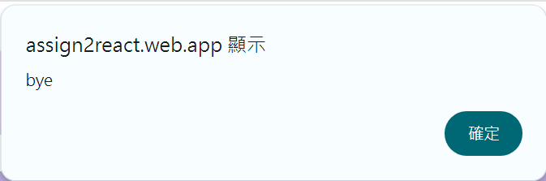

# Software Studio 2023 Spring Midterm Project
## Midterm Project Chatroom

## Announcements
This is a project of the 2023 Spring Software studio class in National Tsing Hua University.
The program is written by daisyliu0225.

## Scoring

| **Basic components** | **Score** | **Check** |
| :------------------- | :-------: | :-------: |
| Membership Mechanism |    15%    |     Y     |
| Firebase page        |    5%     |     Y     |
| Database read/write  |    15%    |     Y     |
| RWD                  |    15%    |     Y     |
| Chatroom             |    20%    |     Y     |

| **Advanced tools**  | **Score** | **Check** |
| :------------------ | :-------: | :-------: |
| Using React         |    10%    |     Y     |
| Third-Party Sign In |    1%     |     Y     |
| Notification        |    5%     |     Y     |
| CSS Animation       |    2%     |     Y     |
| Security            |    2%     |     Y     |

| **Other useful functions** | **Score** | **Check** |
| :------------------------- | :-------: | :-------: |
| Name of functions          |   1~5%    |     Y     |

---

## How to setup your project

- cd assignment 2
- npm init
- npm install
- npm install -g firebase-tools
- npm install firebase@latest
- npm install react-firebase-hooks

---

## How to use
Panel
-
- The project has two panels.
1. Login
  - The first panel is the login page. The panel enables user to login or signup into the chatroom.
  -  
2. Main page
  - The second panel is the main page. It enables users to do the following functions in the app.
  -  

Basic Functions
-
- The following are what the user may do in the chatApp and how to do it. 

Login/Sign up
- 
### Sign up
 - Type the user email and password into email address and password.
 - 
 - Press the sign up button.
 - 
 - The user will be logged in.
 -  
### Sign in
 - Type the user email and password into email address and password.
 - 
 - Press the sign in button.
 - 
 - The user will be logged in.
 -  
### Use google to sign in/sign up
 - Press the google sign in button.
 -  
  

Add Chatroom
-
- The default of a new account will have no chatrooms. To use the app, the user has to create a chatroom first.
- Press the add button next to chat.
- 
- A prompt pops out. Type the chatroom name into prompt.
- 
- 
4. Send Messages
5. Add user to Chatroom
6. Log out
   - Simply click on the Log Out button located on the right top. The app will then alert bye. The user is loggout successfully.
   - 
   - 

---

## Bonus Function description

- Profile/Change name function
1. Profile
   - On the left bottom part of the main panel is the profile. The profile shows the profile picture, name and the email of the user.
   - 
2. Change name function
   - At the bottom of the profile, there is a button that can change the current user's name. The way to change name is easy.
   - Click on the "change name" button, then a prompt will pop out. Type the name user wanted to change the name.
   - Before changing the name
   - 
   - The change name button
   - 
   - Click on the change name, a prompt will pop out.
   - 
   - Type name, press enter in the prompt, and the name will be changed.
   - 

---

### Firebase page link

- [Your web page `URL`](https://assign2react.web.app)

---

### Others (Optional)

- I thought that props was hard but it was easier than I thought and surprisingly convenient.
- This assignment is harder than I thought. The main reason is that if the components are designed badly, things get messed up.
- Why are the firebase manuals sooooo messed up? Many of the functions are not so clearly explained or the examples cannot even run. Many examples tried pop error messages concerning that the function does not exist.

---

### Versions

| Version | Date       | Description                                |
| ------- | ---------- | ------------------------------------------ |
| 1       | 2024/04/14 | successfully deployed on firebase          |
| 2       | 2024/04/15 | login page finished                        |
| 3       | 2024/04/17 | panel css/ message format                  |
| 4       | 2024/04/19 | message/chatroom                           |
| 5       | 2024/04/20 | create chatrooms                           |
| 6       | 2024/04/21 | grab desginated data to user               |
| 7       | 2024/04/23 | add user                                   |
| 8       | 2024/04/27 | switch chatrooms                           |
| 9       | 2024/04/28 | alter switch chatroom method to pass props |
| 10      | 2024/04/28 | notification                               |
| 11      | 2024/04/29 | Profile                                    |
| 12      | 2024/04/29 | Change profile name                        |

--daisyliu0225

